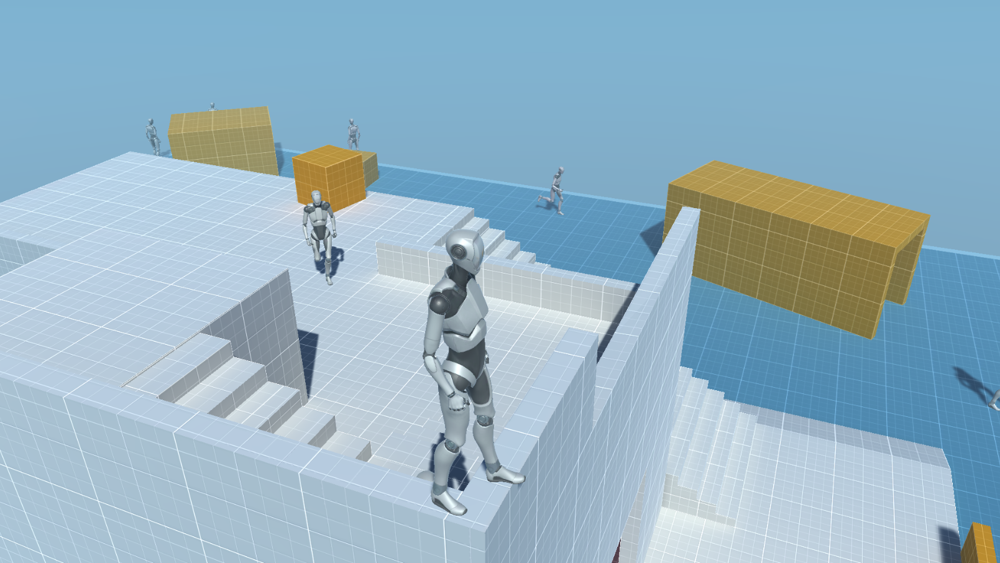

# Game Dev Study: Prototype 4

I made this prototype primarily for studying game AI, but I also used it to understand a bit more about how lightning in Unity.

<!-- 

  

-->

If you'd like to know more about the project and the development process, check it's [page on my website](https://coutinho.codes/portfolio/gamedev/gdstd4).

Made with [Unity](https://unity.com/) & [C#](https://docs.microsoft.com/en-us/dotnet/csharp/).

## 🎮 Play it Online

## 📚 Libraries and Resources
1. [Starter Assets - Third Person Character Controller (Unity Asset)](https://assetstore.unity.com/packages/essentials/starter-assets-third-person-character-controller-196526)

## 📜 Credits
Created, designed, and developed by [Lucas Coutinho](https://coutinho.codes). Open sourced under the [MIT](https://github.com/lcscout/gdstd-4-unity/blob/main/LICENSE) license ❤️.
